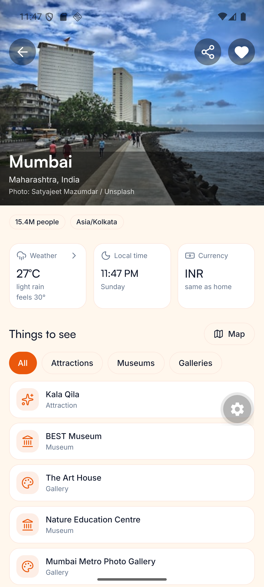
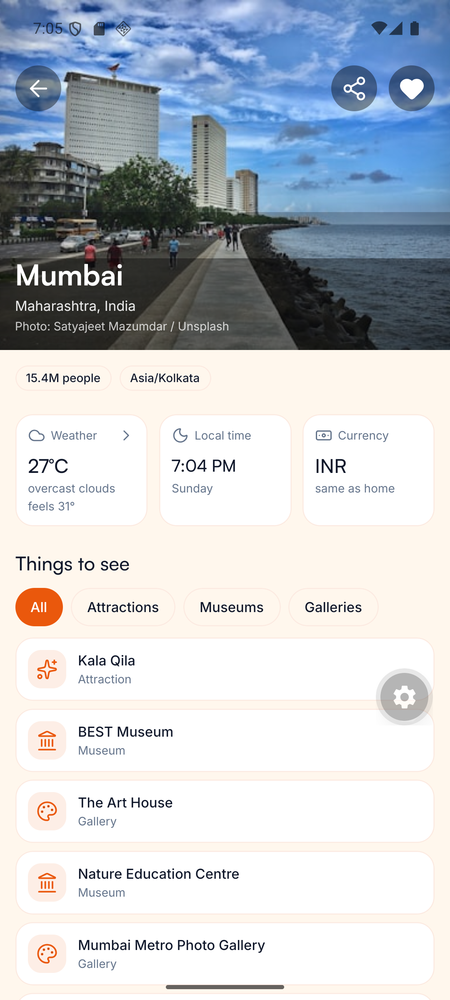
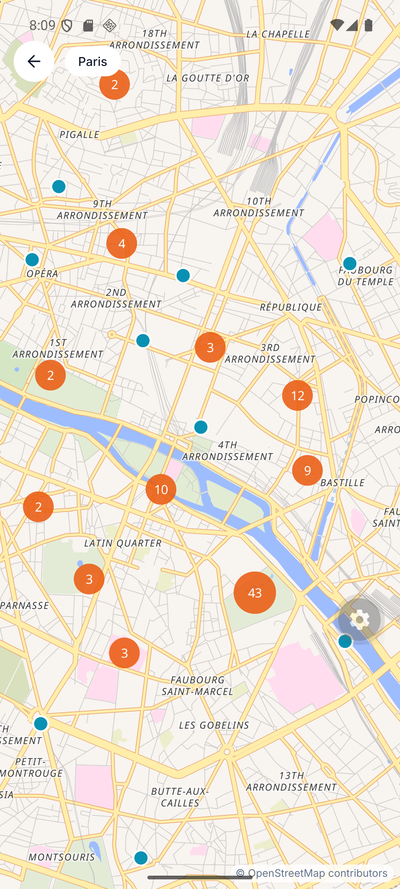
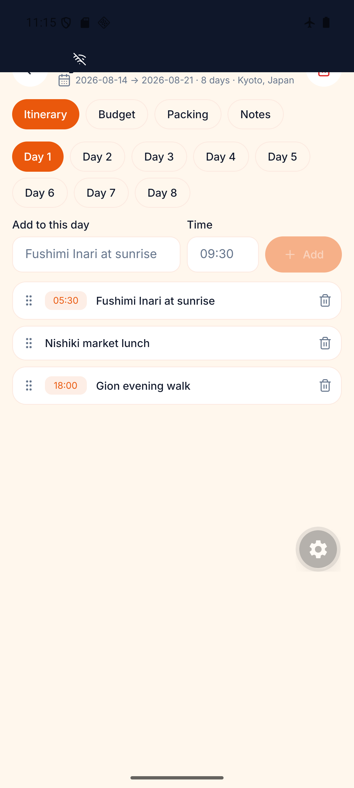
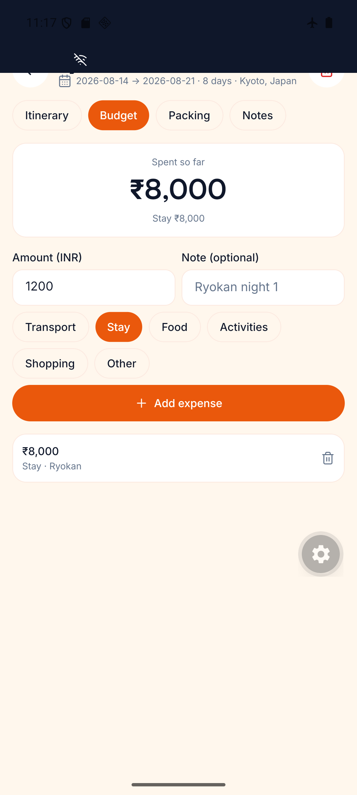
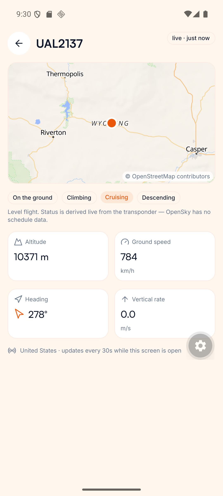
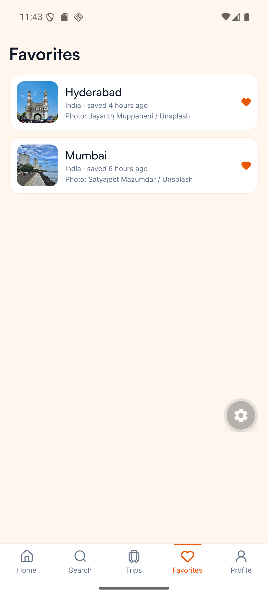
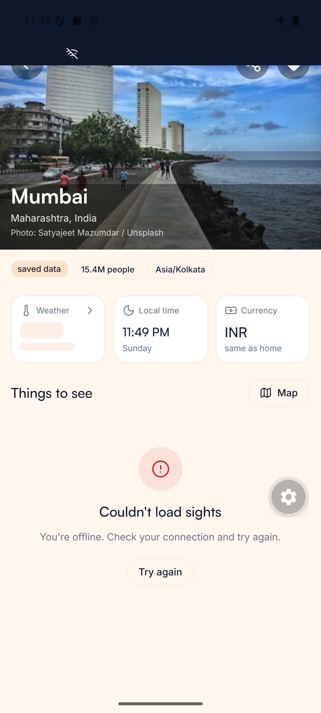
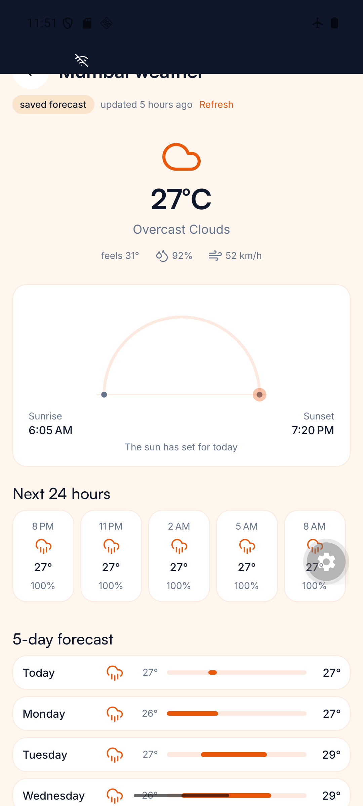

# Roava 🧭

**An offline-first travel companion.** Discover destinations, read forecasts, browse sights on a map, convert currency, track live flights, and plan trips — and keep almost all of it working in airplane mode.

Built with Expo / React Native as a production-quality, frontend-first portfolio project: **no custom backend, free-tier public APIs only, verified feature-by-feature on a real emulator** — with every problem and lesson logged along the way in [docs/JOURNEY.md](docs/JOURNEY.md).

## Screenshots

| Home                                         | Destination                                                    | Weather                                                    | Map                                                 |
| -------------------------------------------- | -------------------------------------------------------------- | ---------------------------------------------------------- | --------------------------------------------------- |
|  |  |  |  |

| Trips                                                  | Budget                                           | Flights                                                | Favorites                                    |
| ------------------------------------------------------ | ------------------------------------------------ | ------------------------------------------------------ | -------------------------------------------- |
|  |  |  |  |

### The offline receipts

Airplane mode on, process killed and relaunched — data survives and every screen says exactly what it's serving:

| Detail from snapshot                                                 | Stale forecast, labeled                                        | Rates with their age                                         |
| -------------------------------------------------------------------- | -------------------------------------------------------------- | ------------------------------------------------------------ |
|  |  |  |

## What's inside

- **Discovery** — trending cities (GeoDB) with Unsplash photography, debounced search with filters and history
- **Destination detail** — parallax hero, live weather / local time / currency snapshot cards that degrade independently, OpenStreetMap sights
- **Weather** — animated sun arc, 3-hourly rail, client-aggregated 5-day forecast, AQI + UV tiles
- **Maps** — MapLibre + OpenFreeMap (keyless), engine-native POI clustering, location permission handled as a first-class state
- **Currency** — whole-table cached converter (one API call ≈ 160 quotes), saved pairs, 12-hour disk TTL with stale-if-error
- **Flights** — live OpenSky tracking with a credit-budgeted polling strategy (area-based billing, measured empirically)
- **Trips** — the offline crown: itineraries with drag-to-reorder days, budgets, packing lists, autosaving notes — 100 % local, versioned storage with corruption recovery
- **Favorites** — swipe-to-remove with a real undo (restores the exact item), photos served from disk cache offline
- **Settings** — theme, home currency (ripples through the app), cache inventory with surgical clear, API attributions

## Architecture

```
screens (src/app — routes only)
   ↓
features (feature UI + logic)
   ↓
hooks / RTK Query (queryFn everywhere — the API layer never leaks upward)
   ↓
repositories (interfaces; live + mock implementations, snapshots, TTL caches)
   ↓
services (axios, per-API DTO mapping, AppError taxonomy)
```

Patterns that carry the app:

- **Offline-first at the repository seam** — last-known-good snapshots, TTL + stale-if-error caches, and a persisted Redux whitelist; screens don't know any of it exists, they just render an `isStale` badge
- **Every async surface** has loading / empty / error / offline states — the airplane-mode audit walks all nine surfaces (screenshots above)
- **Errors are typed** (`AppError` taxonomy) and crashes are screens (expo-router `ErrorBoundary` on every param route)
- **Design tokens only** — after 16 phases, an audit found zero raw colors outside the token files
- **Free-keys-only constraint as a feature** — every API below runs without a billing account; quota budgets are measured and engineered around (see the OpenSky credit math in JOURNEY 14.1)

## APIs (all free tier / keyless)

| Data           | Provider                     | Notes                                      |
| -------------- | ---------------------------- | ------------------------------------------ |
| Cities         | GeoDB Cities (RapidAPI free) | trending + search                          |
| Photos         | Unsplash (demo tier)         | cached once per city, attribution rendered |
| Weather / AQI  | OpenWeather (free)           | 30-min TTL, stale-if-error                 |
| UV index       | Open-Meteo                   | keyless                                    |
| Sights         | OpenStreetMap via Overpass   | keyless; `remark`-as-error guard           |
| Map tiles      | OpenFreeMap                  | keyless; MapLibre renderer                 |
| Exchange rates | open.er-api.com              | keyless; whole-table caching               |
| Live flights   | The OpenSky Network          | anonymous tier, credit-budgeted            |

## Tech stack

Expo SDK 57 (RN 0.86, New Architecture) · TypeScript strict · Expo Router · Redux Toolkit + RTK Query · NativeWind · Reanimated (+ React Compiler) · MMKV · MapLibre RN · FlashList · react-hook-form + zod · @gorhom/bottom-sheet

## Running it

The app uses a **dev build** (not Expo Go — MMKV and MapLibre are native modules).

```bash
npm install
cp .env.example .env          # free API keys; never committed
npx expo run:android          # first time: builds + installs the dev client
npm start                     # thereafter: Metro; open from the dev launcher
```

Gates: `npm run typecheck` · `npm run lint` — enforced with a full typecheck at commit time (husky + lint-staged + Conventional Commits). Release signing and build recipe: [docs/release.md](docs/release.md).

## The documentation trail

| Doc                                | What it is                                                                                                   |
| ---------------------------------- | ------------------------------------------------------------------------------------------------------------ |
| [docs/JOURNEY.md](docs/JOURNEY.md) | **The crown jewel** — 19 chapters of Problem → Diagnosis → Solution → Lesson, plus a Windows RN survival kit |
| [docs/plans/](docs/plans/)         | The master plan + a bite-sized plan per phase, each with verification criteria                               |
| [docs/demo.md](docs/demo.md)       | A five-minute guided demo script                                                                             |
| [docs/release.md](docs/release.md) | Release signing + build recipe                                                                               |

Built phase-by-phase (18 phases), each ending in a 16-point debrief and explicit approval before the next began.
